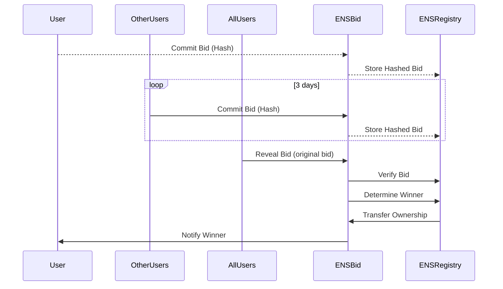

# 10. EVM Lazy Name Spaces

Date: 2024-10-26

## Status

Draft

## Context

- [Ethereum ENS smart contracts](https://github.com/ensdomains/ens-contracts)
- [base-org](https://github.com/base-org/basenames/tree/main)
- [Frontend](https://github.com/ensdomains/ens-app-v3)
- [Js library](https://github.com/ensdomains/ensjs)

- [ENS Ethereum Name Service On-boarding Booth](https://www.youtube.com/watch?v=e1L6uF1HPR0)
- [Frontend integration](https://www.youtube.com/watch?v=4584xbQPBVY)
- [ENS Hack 1](https://www.youtube.com/watch?v=HIDPGdTDCj8)
- [ENS Hack 2](https://www.youtube.com/watch?v=SHuCDqPbAP4)
- [base ENS](https://medium.com/patronum-labs/how-base-eth-names-work-a9578724520a)

### Commit and reveal pattern (Register)

Hidden bid first 3 days, the domain bid is publish. After 3 first days, bids are show and the higher bid wins, but the winner pay the second higher bid (not his bid).



```gherkin
Given a user wants to participate in an ENS auction for a domain name.

When the user:

1. Hashes their bid:
- Calculates the hash of their desired bid amount using a cryptographic hash function.

2. Submits the hashed bid:
- Sends the calculated hash to the ENS auction smart contract.

3. Waits for the reveal period:
- Waits for the specified reveal period to end.

4. Reveals their bid:
- Sends both the original bid amount and the previously submitted hash to the smart contract.

Then the smart contract:

1. Verifies the hash:
- Calculates the hash of the revealed bid amount and compares it to the stored hash.

2. Determines the winner:
- Compares all revealed bids and identifies the highest bid.

3. Transfers ownership:
- Transfers ownership of the domain name to the highest bidder.
```

- Should users that **stake** their nfts and earn points, should the bid only available with **points**?

- `lazy.fun` domain should be unavailable for the BID system as it considered as reserved.
- Frontend that handle the web app (`lazy.manager.fun` SUBDOMAIN for example)
  - Ex: [jesse.base.eth](https://app.ens.domains/jesse.base.eth)
- LNS should use IPFS for metadata ( ex: user links,etc)

- Should we use CCIP?
  - CCIP stands for Cross-Chain Interoperability Protocol. In the context of ENS, it's used to enable cross-chain and off-chain resolution of ENS domains. This means that ENS domains can now point to data stored on Layer 2 chains or even off-chain, making the system more flexible and efficient.

```mermaid

```

## Decision

The change that we're proposing or have agreed to implement.

## Consequences

What becomes easier or more difficult to do and any risks introduced by the change that will need to be mitigated.
