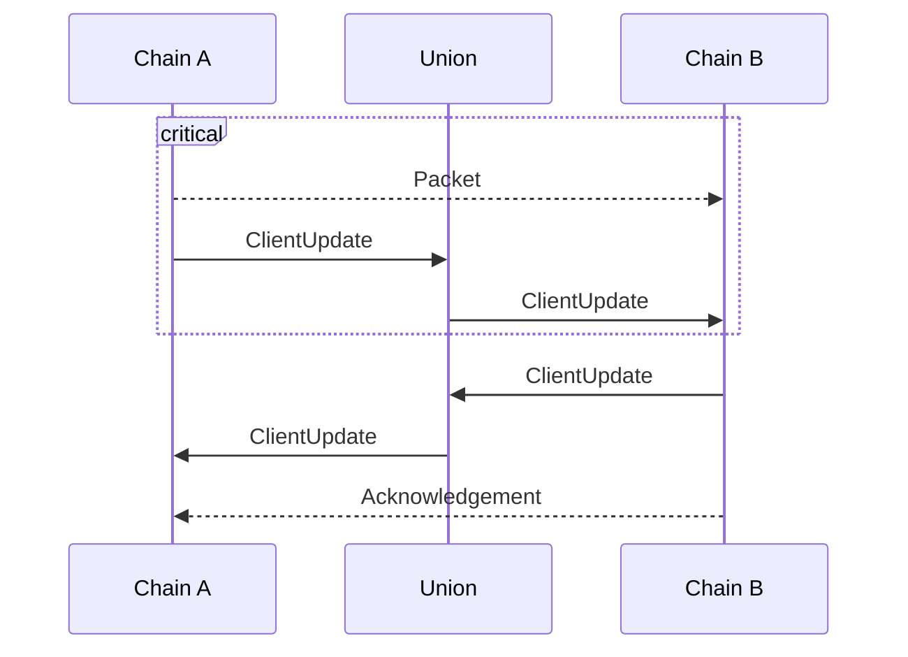
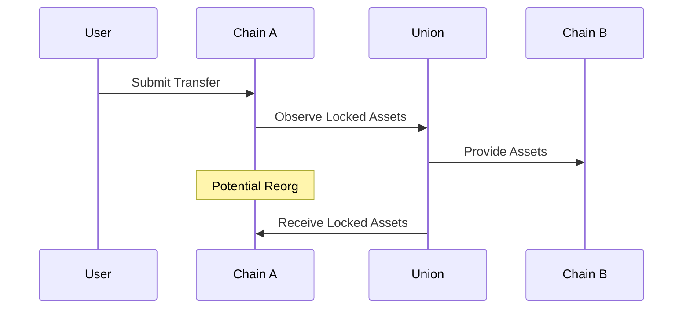
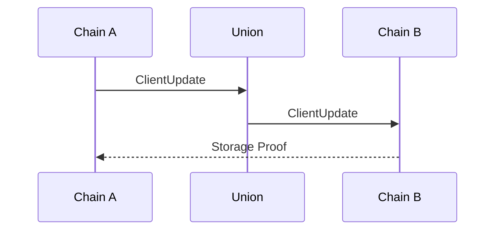

# 11. Union IBC Bridge

Date: 2024-10-26

## Status

Draft

## Context

### Protocol

The main mode, which always succeeds for any chain, leverages state lenses to create a recursive connection and a communication channel between two chains.

Filler == Union blockchain

### Recursive connections

`ClientUpdates` leverages a recursive storage proof to fetch the client state held by another chain.
This allows chain B to accept storage proofs over chain A without needing to dispatch packets to Union, reducing query latency.

## Decision

The change that we're proposing or have agreed to implement.

## Consequences

What becomes easier or more difficult to do and any risks introduced by the change that will need to be mitigated.
