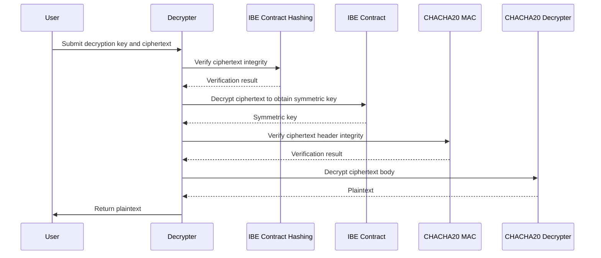
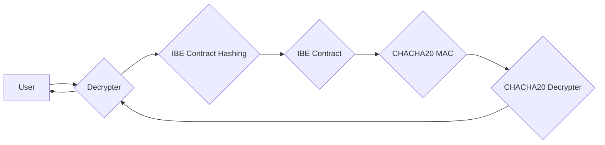

# Faiblock

## Goal

Analysis, Design and implementation of an smart contract app that allow the users to play a `lottery` system gaining nfts in the process.

## Links

- [Fairblock Architecture](https://docs.fairblock.network/assets/images/cosmos_architecture-67fb3256597a774426ea433ea56a3d62.png)
- [commit-reveal-scheme](https://blog.jarrodwatts.com/understanding-the-commit-reveal-scheme-with-solidity-examples)
- [randomness-in-solidity](https://medium.com/coinmonks/randomness-in-solidity-933eaa6ccff1)

## Fairblock Smart contracts

- **IBE_HASHING** : `ibe-contract-hashing.wasm` verifies the correctness of the ciphertext based on the Boneh-Franklin Identity-Based Encryption (BF-IBE) algorithm. It calculates a hash over the message and sigma, multiplies it by P, and verifies that the result matches the U component in the ciphertext.
- **IBE_CONTRACT**: `ibe.wasm` decrypts the ciphertext and recovers the message (which is the symmetric key for the second layer of encryption). It leverages the IBE Contract (Hashing) for ciphertext validation.
- **CHACHA20_MAC**: `chacha20mac.wasm` computes the MAC for the ciphertext header using the key and ciphertext body.
- **CHACHA20_DECRYPTER**: `chacha20.wasm` performs symmetric key decryption using the provided key and returns the plaintext.
- **DECRYPTER**: `decrypter.wasm` serves as the main interface for the decryption process. It accepts the decryption key and ciphertext, invoking the appropriate contracts to perform the full decryption.





## Integration

### Collector Smart Contract

Simple smart contract that receive the fees from the `lottery` smart contract and can be claimed only by the `owner` of the contract.

Functions:

- EXECUTE:OWNER: instantiate
- EXECUTE:OWNER: claim() -> Result( (), error )
  - Verifies owner
  - send funds to the owner
- QUERY: funds() -> Result (amount:number)
  - check balance.

### Lottery Smart Contract

The `lottery` contract is the responsible for:

- Ownership the nfts until users winds, in that case it should transfer any `random nft` ownership to the winner.
- Keep track of `total_draws` and `lucky_10_ranking` (how successful is the market campaign and top 10 luckiest users for dashboard).

Functions:

- EXECUTE:OWNER:constructor(address decrypter, number fees, number threshold)
- EXECUTE:OWNER:finalizeCampaign()
  - set true to campaignFinalized
- EXECUTE:OWNER:startCampaign()
  - set false to campaignFinalized
- EXECUTE:ANYONE:draw() -> Result(draw:boolean, error)
  - check campaignFinalized == false.
  - Call random generator (Fairblock or commit-reveal-scheme) to get a number from 0 to 100
  - check if generated random > threshold
    - true:
      - Increase total_draws
      - Change an NFT ownership to user addr.
      - Update lucky_10_ranking[].
      - Emit Winner Event
    - false:
      - Increase total_draws
      - Emit Lose Event
- QUERY:ANYONE:dashboard() -> Result({addr: count}[])
  - return lucky_10_ranking[]
- QUERY:ANYONE:total_draws() -> Result(count: number)

```solidity
    /**
     * @notice Initializes the lottery with a decryption contract, a start_time and a fee.
     * @param _decrypter Address of the decryption contract
     * @param _fee The fee required to submit a draw
     * @param _threshold Number to decide  if draw success or fail. Must be less than 100.
     */
    constructor(address _decrypter, uint256 _fee, uint128 _threshold) {
        owner = msg.sender;
        decrypterContract = IDecrypter(_decrypter);
        fee = _fee;
        campaignFinalized = true;
        threshold = _threshold;
        emit LotteryInitialized(_decrypter,_fee);
    }
```
