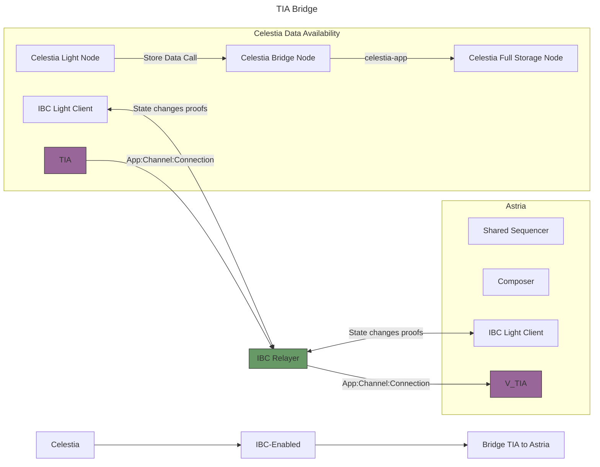
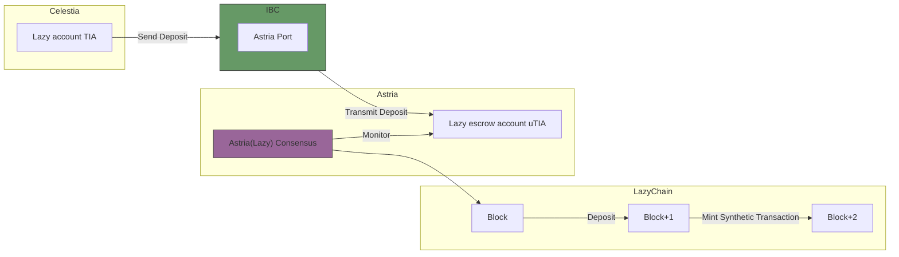
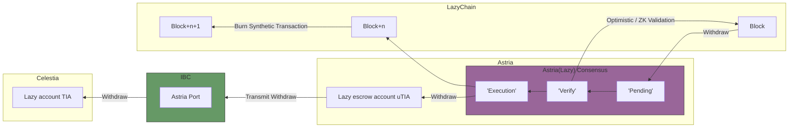
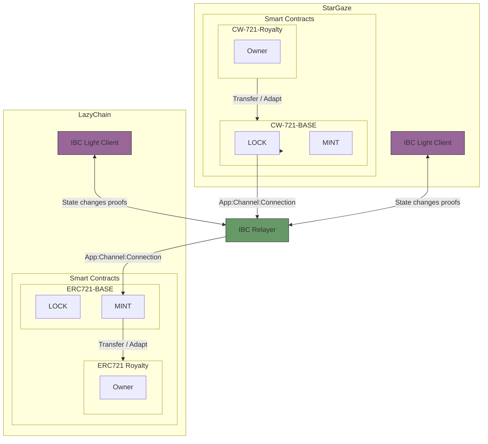
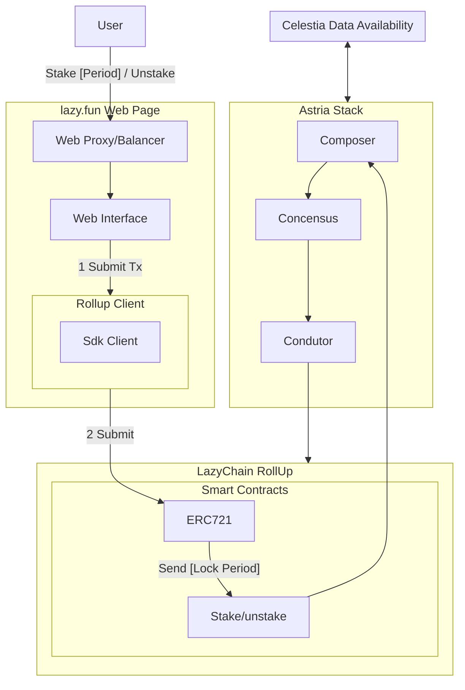
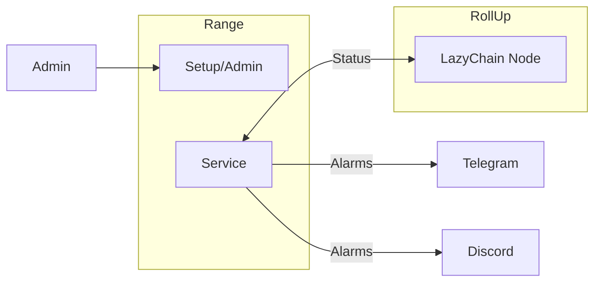

# Astria Design

## Context

Celestine Sloth Society wants to have his own blockchain to evolve his main product NFT collection.
We are going to investigate Astria to create a **modular blockchain** using **Sovereign Rollups** using Geth as **Execution Layer**, **Astria** as **Settlement and consensus** layer (**cometBFT**, **decentralized sequencing**) and **Celestia** as **Data Availability** layer.

## Main Goal

- Create a **modular blockchain** using **Sovereign Rollups** using Geth as **Execution Layer**, **Astria** as **Settlement and consensus** layer (**cometBFT**) and **Celestia** as **Data Availability** layer.
- Transfer NFT Collections from other blockchains.
- Allow users to Stake their NFT.

## Sub Goals

- The system should be distributed, secure and scalable.

### Links

- [Celestia](https://celestia.org/what-is-celestia/)
- [Geth](https://Geth.rs/)
  - [Geth Node](https://github.com/astriaorg/Geth)
- [Astria](https://www.astria.org/)
  - [Rollup Node](https://github.com/astriaorg/astria-geth)
  - [Decentralized Sequencer](https://docs.astria.org/overview/components/the-astria-sequencing-layer)
    - [Composer](https://docs.astria.org/overview/components/composer)
    - [Relayer](https://docs.astria.org/overview/components/relayer)
    - [Conductor](https://docs.astria.org/overview/components/conductor)

### Architecture

- **Composer**: The Composer can be described as a "gas station", underwriting the sequencing costs for users' rollup transactions. This allows order-agnostic users to simply pay for transaction execution in the rollup's native gas token without needing to maintain a sequencer wallet, as long as the operator keeps the Composer funded.
- **Astria Sequencing Layer**: `Astria blockchain` CometBFT consensus algorithm.  It primarily orders transactions without executing them, as they are intended for execution on rollups. However, it does execute "sequencer native" transactions like token transfers within the sequencer chain.
- **Relayer**: Fetch validated blocks from the sequencer and pass them along to the DA layer
- **Data Availability Layer**: `Celestia` blockchain.
- **Conductor**: Its role is to connect the sequencer and Data Availability layers to the rollup execution layer by extracting the transactions belonging to the rollup node from each sequencer block, and forwarding them to the execution layer.

```mermaid
flowchart LR
    subgraph RollUp["RollUp Full Node"]
        subgraph Runtime["Execution Layer"]
            C[LazyChain]
        end
        G[Conductor]
    end
    subgraph Concensus["Concensus Layer"]
        E[Astria Shared Sequencer]
    end

    D{Astria Composer}
    F[Astria Relayer]

    subgraph Persistence["Persistence Layer"]
        H[Celestia]
    end
    
    C -- Send Tx --> D
    D -- Gas Expenses and Txs --> E
    E -- Relay --> F
    F -- Fetch validated blocks to Persist --> H

    H -- Update Persisted State --> G
    E -- Notify Update State --> G
    G -- Update State --> C 

    classDef green fill:#696,stroke:#333;
    classDef purple fill:#969,stroke:#333;
    classDef orange fill:#f96
    classDef blue fill:#303
    classDef bar stroke:#0f0
    class E blue
    class C green
    class H purple
    class G bar

```

A rollup light node needs to:

1. Implement an L1 consensus light client
2. Implement an L2 consensus light client
3. Ensure that the transaction data for each L2 block was published

A light node of a rollup that uses a sequencing layer needs to verify the consensus of the sequencer chain, as the sequencer acts as the equivalent of the L1 - i.e. it’s where transaction inclusion and ordering is finalized.

It needs to follow the headers and verify consensus of the sequencer chain. Since light nodes don’t store the blockchain state, to verify if a rollup transaction was included in some rollup block X, the light node first needs a Merkle proof that the rollup transaction was included in the transactions/data root of some sequencer chain header.

Then, if it follows that rollup block X was derived from sequencer block Y (using the rollup derivation function), it knows that the transaction should be included in rollup block X.

The light node also needs to check that the block data was published, which it can do via data availability sampling (for example, when using Celestia).

#### Data Availability Flow

```mermaid
flowchart TB
    User["User"]

    subgraph Frontend["lazy.fun"]
        subgraph RKC["RollUp Client"]
            RKC_A["Client"] 
            RKC_B["go-da"] 
            RKC_A-- "Message" -->RKC_B
        end
        Proxy["Web Proxy/Balancer"]
        UI["Web Interface"]
        Proxy --> UI
    end

    subgraph RollUp["RollUp Full Node"]
        subgraph C["LazyChain"]
            subgraph RU_SC["Smart Contracts"]
                RK_SC_721["NFT"]
            end
        end
        G[Conductor]
    end
    subgraph Concensus["Concensus Layer"]
        E[Shared Sequencer]
    end

    D{Composer}
    F[Relayer]

    subgraph Celestia["Celestia Data Availability"]
        CL_LN["Celestia Light Node"]
        CL_BN["Celestia Bridge Node"] 
        CL_FN["Celestia Full Storage Node"]

        CL_LN-- "Store Data Call" --> CL_BN
        CL_BN-- "celestia-app" -->CL_FN
    end

    User -- Interact --> Proxy
    UI --1 Submit Tx--> RKC
    RKC -- 2 Submit --> C
    C -- 4 Notify Tx --> D
    D -- 5 Add Tx -->E
    E -- 6 Relay --> F
    F -- 7 Fetch validated blocks to Persist --> Celestia
    Celestia -- 8 Update Persisted State --> G
    E -- 8 Notify Update State --> G
    G -- Update State --> C 

    classDef green fill:#696,stroke:#333;
    classDef purple fill:#969,stroke:#333;
    classDef orange fill:#f96
    classDef bar stroke:#0f0
    classDef blue fill:#303
    class RK_GF purple
    class RK_SEQ green
    class RK_SC_721 green
    class E blue
    class G bar
```

#### Bridging TIA to Lazychain

- Single Fee Token:
  - Bridge DA Token to Sequencer
  - Bridge DA Token to Rollup

##### From Celestia to Astria (IBC)

#### From Celestia to Lazychain

From `Celestia`, tokens are transferred to some escrow account/contract on `Astria` via `IBC`.
The `Lazy rollup consensus` node, which derives transactions from `Astria` data, `sees` these deposits on the `Lazy scrow account on Astria`, and includes a corresponding `deposit` transaction in the **next** `Lazy` block, which is a distinct transaction type.
The `Lazy` node executes these deposit transactions, minting synthetic funds on the `Lazy` to the respective account.

#### From lazy to Celestia

From `Lazy` to `Celestia Lazy account` requires proving rollup block state roots on `Astria`.
This is the “optimistic” or “ZK” parts of the rollup.
To implement bridging from `Lazy Rollup` back to the `Astria sequencer` or `DA network`, we need to add functionality to verify `Lazy rollup state` rollups on `Astria` or `Celestia`.
On the `Astria sequencer`, this would mean enshrining some sort of state root verification actor in the sequencer’s state machine, which could be instantiated by the rollup and used to bridge to the `sequencer/ Lazy Concensus`. 
Since we’re using `Celestia` as DA, which does not support any sort of programmability, the only way to bridge from the rollup to Celestia would be first through the `Astria sequencer`, then back to `Celestia` through IBC.

#### NFT Transfer from StarGaze using IBC

#### STAKE

#### Tasks

> **Tasks**

- Create a Bridge UI for NFT
  - Integrate Front end Flame webapp using [astria-bridge-web-app](https://github.com/astriaorg/astria-bridge-web-app)
- Run and create `Geth` node for lazyChain.
  - Deploy lazy smart contracts ERC1155 and ERC721.
  - Create contract adapters to apply `Royalty` to `ERC721` and `CW721` and reversal.
- Run `Conductor` for `Geth`?

#### Monitoring

> **Tasks**

- Create account into Range
- Setup Telegram and Discord Alarms
- Setup Service backend (RPC)

#### Oracle Sidecar

- [oracle-client](https://docs.skip.build/connect/developers/integration#oracle-client)

> **Tasks**

#### Faucet

- [faucet](https://github.com/Lazychain/eth-faucet)

#### Explorer

- [blockscout](https://github.com/blockscout/blockscout)
- [blockscout-frontend](https://github.com/Lazychain/blockscout-frontend)

#### Frontend Bridge

- [astria-bridge-web-app](https://github.com/astriaorg/astria-bridge-web-app)
