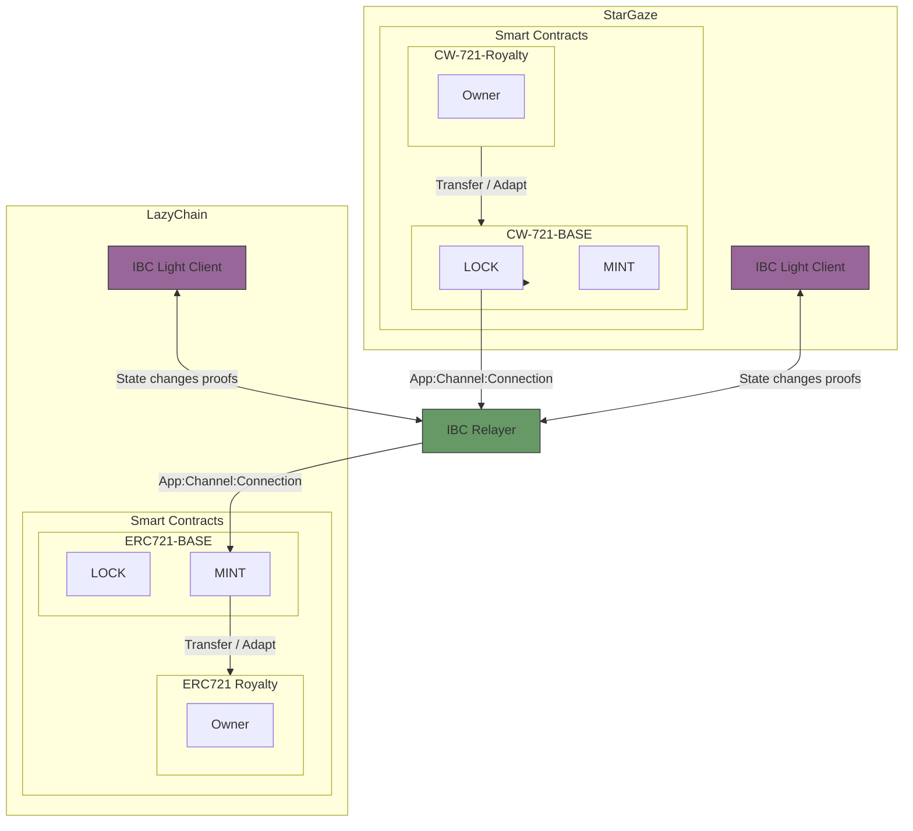
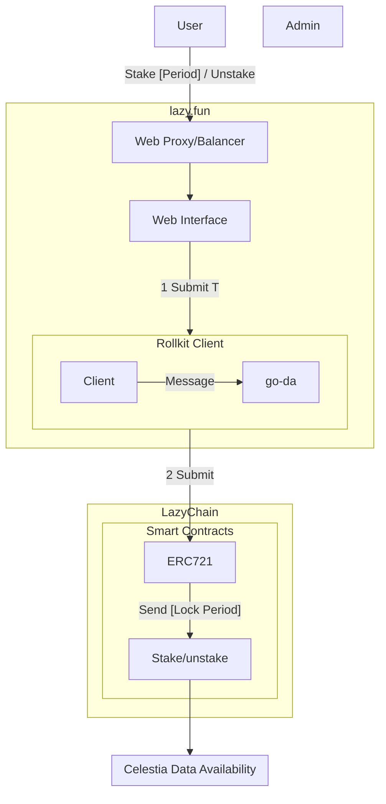
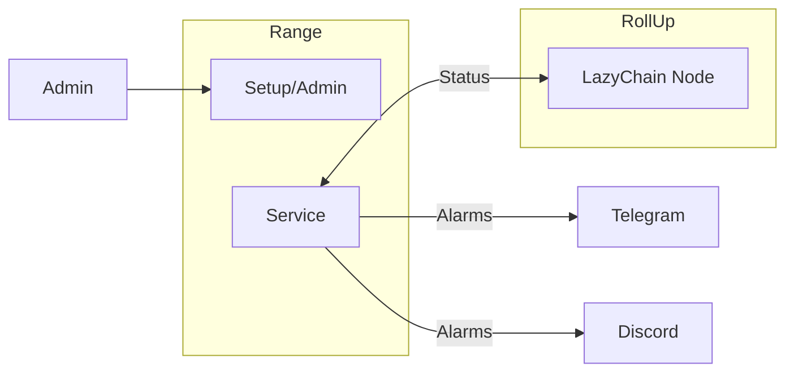

# Astria Design

## Context

Celestine Sloth Society wants to have his own blockchain to evolve his main product NFT collection.
We are going to investigate Astria to create a **modular blockchain** using **Sovereign Rollups** using Artela EVM++/Reth as **Execution Layer**, **Astria** as **Settlement and consensus** layer (**cometBFT**, **decentralized sequencing**) and **Celestia** as **Data Availability** layer.

## Main Goal

- Create a **modular blockchain** using **Sovereign Rollups** using Artela EVM++/ Reth as **Execution Layer**, **Astria** as **Settlement and consensus** layer (**cometBFT**) and **Celestia** as **Data Availability** layer.
- Transfer NFT Collections from other blockchains.
- Allow users to Stake their NFT.

## Sub Goals

- The system should be distributed, secure and scalable.

### Links

- [Celestia](https://celestia.org/what-is-celestia/)
- [Artela](https://docs.artela.network/develop)
  - [Artela Node](https://github.com/artela-network/artela)
- [Reth](https://reth.rs/)
  - [Reth Node](https://github.com/astriaorg/reth)
- [Astria](https://www.astria.org/)
  - [Rollup Node](https://github.com/astriaorg/astria-geth)
  - [Decentralized Sequencer](https://docs.astria.org/overview/components/the-astria-sequencing-layer)
    - [Composer](https://docs.astria.org/overview/components/composer)
    - [Relayer](https://docs.astria.org/overview/components/relayer)
    - [Conductor](https://docs.astria.org/overview/components/conductor)

### Design ADRs

- [NFT Transfer](../adr/0014-nft-transfer.md)

### Architecture

- **Composer**: The Composer can be described as a "gas station", underwriting the sequencing costs for users' rollup transactions. This allows order-agnostic users to simply pay for transaction execution in the rollup's native gas token without needing to maintain a sequencer wallet, as long as the operator keeps the Composer funded.
- **Astria Sequencing Layer**: `Astria blockchain` CometBFT consensus algorithm.  it primarily orders transactions without executing them, as they are intended for execution on rollups. However, it does execute "sequencer native" transactions like token transfers within the sequencer chain.
- **Relayer**: Fetch validated blocks from the sequencer and pass them along to the DA layer
- **Data Availability Layer**: `Celestia` blockchain.
- **Conductor**: Its role is to connect the sequencer and Data Availability layers to the rollup execution layer by extracting the transactions belonging to the rollup node from each sequencer block, and forwarding them to the execution layer.

```mermaid
flowchart LR
    subgraph RollUp["RollUp Full Node"]
        subgraph Runtime["Execution Layer"]
            C[LazyChain]
        end
        G[Conductor]
    end
    subgraph Concensus["Concensus Layer"]
        E[Astria Shared Sequencer]
    end

    D{Astria Composer}
    F[Astria Relayer]

    subgraph Persistence["Persistence Layer"]
        H[Celestia]
    end
    
    C -- Send Tx --> D
    D -- Gas Expenses and Txs --> E
    E -- Relay --> F
    F -- Fetch validated blocks to Persist --> H

    H -- Update Persisted State --> G
    E -- Notify Update State --> G
    G -- Update State --> C 

    classDef green fill:#696,stroke:#333;
    classDef purple fill:#969,stroke:#333;
    classDef orange fill:#f96
    classDef blue fill:#303
    classDef bar stroke:#0f0
    class E blue
    class C green
    class H purple
    class G bar

```

#### Data Availability Flow

```mermaid
flowchart TB
    User["User"]

    subgraph Frontend["lazy.fun"]
        subgraph RKC["RollUp Client"]
            RKC_A["Client"] 
            RKC_B["go-da"] 
            RKC_A-- "Message" -->RKC_B
        end
        Proxy["Web Proxy/Balancer"]
        UI["Web Interface"]
        Proxy --> UI
    end

    subgraph RollUp["RollUp Full Node"]
        subgraph C["LazyChain"]
            subgraph RU_SC["Smart Contracts"]
                RK_SC_721["NFT"]
            end
        end
        G[Conductor]
    end
    subgraph Concensus["Concensus Layer"]
        E[Shared Sequencer]
    end

    D{Composer}
    F[Relayer]

    subgraph Celestia["Celestia Data Availability"]
        CL_LN["Celestia Light Node"]
        CL_BN["Celestia Bridge Node"] 
        CL_FN["Celestia Full Storage Node"]

        CL_LN-- "Store Data Call" --> CL_BN
        CL_BN-- "celestia-app" -->CL_FN
    end

    User -- Interact --> Proxy
    UI --1 Submit Tx--> RKC
    RKC -- 2 Submit --> C
    C -- 4 Notify Tx --> D
    D -- 5 Add Tx -->E
    E -- 6 Relay --> F
    F -- 7 Fetch validated blocks to Persist --> Celestia
    Celestia -- 8 Update Persisted State --> G
    E -- 8 Notify Update State --> G
    G -- Update State --> C 

    classDef green fill:#696,stroke:#333;
    classDef purple fill:#969,stroke:#333;
    classDef orange fill:#f96
    classDef bar stroke:#0f0
    classDef blue fill:#303
    class RK_GF purple
    class RK_SEQ green
    class RK_SC_721 green
    class E blue
    class G bar
```

#### NFT Transfer from StarGaze using IBC

#### STAKE

> **Tasks**

- Create a Bridge UI for NFT
  - Integrate Front end Flame webapp using [astria-bridge-web-app](https://github.com/astriaorg/astria-bridge-web-app)
- Run and create `Artela/Reth` node for lazyChain.
  - Deploy lazy smart contracts ERC1155 and ERC721.
  - Create contract adapters to apply `Royalty` to `ERC721` and `CW721` and reversal.
- Run `Conductor` for `Artela/Geth`?

#### Monitoring

> **Tasks**

- Create account into Range
- Setup Telegram and Discord Alarms
- Setup Service backend (RPC)

#### Oracle Sidecar

- [oracle-client](https://docs.skip.build/connect/developers/integration#oracle-client)

> **Tasks**

#### Faucet

- [faucet-frontend](https://github.com/artela-network/faucet-frontend)

#### Explorer

- [block-explorer](https://github.com/artela-network/block-explorer)
- [block-explorer-frontend](https://github.com/artela-network/block-explorer-frontend)

#### Dashboard

- [evm-dashboard](https://github.com/artela-network/evm-dashboard)

#### Frontend Bridge

- [astria-bridge-web-app](https://github.com/astriaorg/astria-bridge-web-app)
