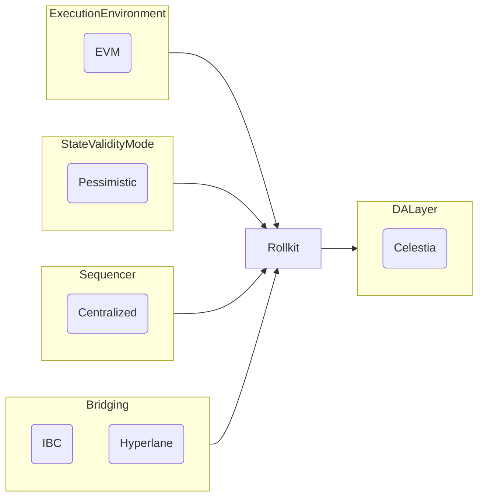

# Architecture

```mermaid
flowchart LR
    subgraph ExecutionEnvironment
        A(EVM)
    end

    subgraph StateValidityMode
        E(Pessimistic)
    end

    subgraph Sequencer
        H(Centralized)
    end

    subgraph Bridging
        K(IBC)
        L(Hyperlane)
    end

    subgraph DALayer
        N(Celestia)
    end

    ExecutionEnvironment --> Rollkit
    StateValidityMode --> Rollkit
    Sequencer --> Rollkit
    Bridging --> Rollkit
    Rollkit --> DALayer
```
