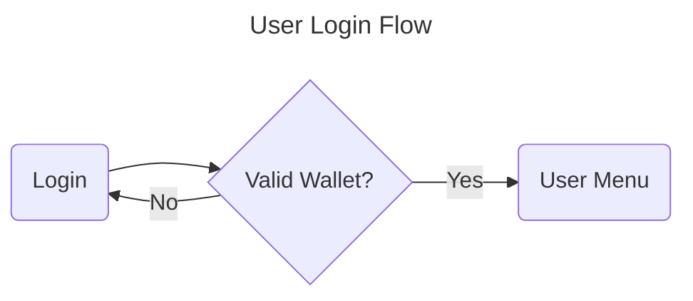

# 1. User Login



```gherkin
Feature: User Login
  As a user
  I want to be able to log in with valid credentials
  So that I can access the system

Scenario: Valid login
  Given I have provided valid username and password
  When I submit the login form
  Then I should see the Books Selection Flow page

Scenario: Invalid login
  Given I have provided invalid username or password
  When I submit the login form
  Then I should be prompted to re-enter my credentials
  And I will not see the Books Selection Flow page
```

## Acceptance Criteria

### User Login Feature

AC1: Successful Login with Valid Credentials

* **ID:** AC-LOGIN-1
* **Description:** User can log in successfully with valid username and password.
* **Criteria:**

 1. **Precondition:** User has a valid username and password.
 2. **Step:** User submits the login form with valid credentials.
 3. **Expected Result:**
     * User is redirected to the Books Selection Flow page.
     * No error messages are displayed.

 4. **Acceptance Threshold:** 100% of attempts with valid credentials result in successful login.

AC2: Handling of Invalid Login Credentials

* **ID:** AC-LOGIN-2
* **Description:** System correctly handles invalid username or password.
* **Criteria:**

 1. **Precondition:** User attempts to log in with either an invalid username or an incorrect password.
 2. **Step:** User submits the login form with invalid credentials.
 3. **Expected Result:**

    * User is prompted to re-enter their credentials.
    * An appropriate error message is displayed (e.g., "Invalid username or password").
    * User is not redirected to the Books Selection Flow page.

 4. **Acceptance Threshold:**

* 100% of attempts with invalid credentials trigger the re-entry prompt.
* Error message is clear and concise in 100% of cases.

Common Criteria for Both Scenarios

* **AC-LOGIN-3: Form Submission Feedback**
  * After submitting the login form, user receives immediate feedback (success or error message) within 3 seconds.
* **AC-LOGIN-4: Security**
  * The login process ensures the secure transmission of credentials (e.g., HTTPS).
  * Passwords are not stored in plaintext in the system.

### Test Data Requirements for Acceptance Testing

* Valid username and password combinations (at least 3 sets)
* Invalid username with valid password combinations (at least 2 sets)
* Valid username with invalid password combinations (at least 2 sets)
* Edge cases (e.g., username/password with special characters, numbers, etc.)

### Definition of Done (DoD)

* All acceptance criteria (AC1 through AC-LOGIN-4) are met.
* Testing has been conducted with the specified test data, covering all happy and sad paths.
* Security audits confirm the secure handling and storage of user credentials.
* Stakeholder approval is obtained after a successful demo of the login feature.
