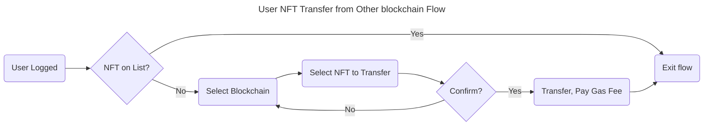

# 2. User NFT Transfer from Other blockchain Flow

## Flowchart



::: tip
Should we consider from lazy chain to send back to origin blockchains?
:::

## User Scenarios

### Scenario 1: NFT Already on List (Early Exit)

```gherkin
Feature: User NFT Transfer from Other Blockchain
Title: User attempts transfer with NFT already on the list

Given the user is logged in
And the NFT is already on the list
When the user initiates the NFT transfer process
Then the flow exits without prompting for further actions
And the user is notified that the NFT is already on the list.
```

### Scenario 2: Successful Transfer with Confirmation

```gherkin
Title: User successfully transfers NFT from another blockchain with confirmation.

Given the user is logged in
And the NFT is not on the list
When the user selects the blockchain of the NFT
And the user selects the NFT to transfer
And the user confirms the transfer
Then the system initiates the NFT transfer
And the user is prompted to pay the gas fee
And upon successful payment, the NFT is transferred
And the user is notified of the successful transfer.
```

### Scenario 3: Transfer Cancellation (No Confirmation)

```gherkin
Title: User cancels NFT transfer by denying confirmation

Given the user is logged in
And the NFT is not on the list
When the user selects the blockchain of the NFT
And the user selects the NFT to transfer
But the user denies the transfer confirmation
Then the transfer process is cancelled
And the user is returned to the blockchain selection step
And the user can restart the process or exit.
```

### Scenario 4: Edge Case - Multiple Iterations (No, then Yes on Confirmation)

```gherkin
Title: User initially denies transfer but then confirms after re-selection

Given the user is logged in
And the NFT is not on the list
When the user selects the blockchain of the NFT
And the user selects the NFT to transfer
But the user denies the transfer confirmation
And the user is returned to the blockchain selection step
And the user re-selects the same blockchain and NFT
And this time, the user confirms the transfer
Then the system initiates the NFT transfer
And the user is prompted to pay the gas fee
And upon successful payment, the NFT is transferred
And the user is notified of the successful transfer
```

