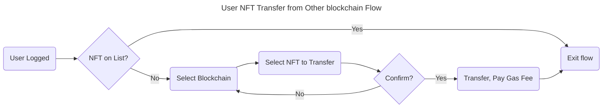

# 2. User NFT Transfer from Other blockchain Flow

```mermaid
---
title: User NFT Transfer from Other blockchain Flow
---
flowchart LR
    A(User Logged) --> B{NFT on List?}
    B --> |Yes| X(Exit flow)
    B --> |No| C(Select Blockchain)
    C --> D(Select NFT to Transfer)
    D --> E{Confirm?}
    E --> |No| C
    E --> |Yes| Y(Transfer, Pay Gas Fee)
    Y --> X
```

::: tip
Should we consider from lazy chain to send back to origin blockchains?
:::

::: warning
Add gherkin scenarios
:::
