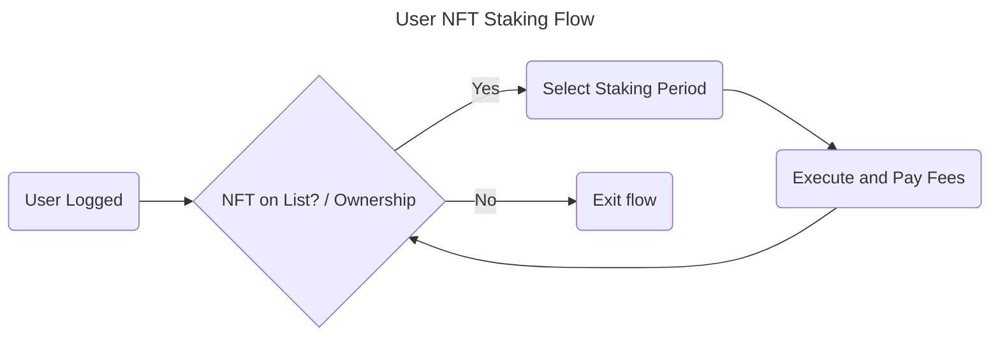

# 3. User NFT Staking Flow



## User Scenarios

### Feature: User NFT Staking

#### Scenario 1: Successful Staking with NFT on List

Title: User successfully stakes NFT when it's on the list

```gherkin
Given the user is logged in
And the user's NFT is on the staking list
When the user selects a staking period
And the user executes the staking and pays the fees
Then the staking is successfully applied to the NFT
And the user is redirected back to the NFT list for potential further staking
```

#### Scenario 2: NFT Not on List - Exit Flow

Title: User exits flow when NFT is not on the staking list

```gherkin
Given the user is logged in
And the user's NFT is not on the staking list
When the user attempts to stake the NFT
Then the user is notified that the NFT is not eligible for staking
And the staking flow is exited
And the user is not prompted for staking period or fees
```

#### Scenario 3: Multiple Stakings (Edge Case)

Title: User can stake multiple times with NFT on the list

```gherkin
Given the user is logged in
And the user's NFT is on the staking list
When the user selects a staking period and executes the staking, paying the fees
And the user again selects a staking period for the same NFT and executes the staking, paying the fees
Then both stakings are successfully applied to the NFT
And the user is redirected back to the NFT list after each staking
And the NFT's updated staking status is reflected
```

### Acceptance Criteria for User NFT Staking Flow

#### AC1: Successful Staking with NFT on List

* **ID:** AC-STAKE-1
* **Description:** User can successfully stake an NFT on the list.
* **Criteria:**

 1. **Precondition:** User is logged in, NFT is on the staking list.
 2. **Step:** User selects staking period, executes staking, and pays fees.
 3. **Expected Result:**

    * Staking is applied successfully.
    * User is redirected back to the NFT list.

 4. **Acceptance Threshold:** 100% success rate for staking with NFTs on the list.

#### AC2: Handling NFT Not on List

* **ID:** AC-STAKE-2
* **Description:** System correctly handles NFTs not on the staking list.
* **Criteria:**

 1. **Precondition:** User is logged in, NFT is not on the staking list.
 2. **Step:** User attempts to stake the NFT.
 3. **Expected Result:**

     * User is notified of ineligibility.
     * Flow is exited without prompting for staking period or fees.

 4. **Acceptance Threshold:** 100% of attempts with NFTs not on the list result in correct notification and flow exit.

#### AC3: Multiple Stakings

* **ID:** AC-STAKE-3
* **Description:** System allows and correctly handles multiple stakings of the same NFT.
* **Criteria:**

 1. **Precondition:** User is logged in, NFT is on the staking list.
 2. **Step:** User performs multiple stakings of the same NFT.
 3. **Expected Result:**

     * All stakings are successfully applied.
     * User is redirected back to the NFT list after each staking.
     * NFT's updated staking status is correctly reflected.

 4. **Acceptance Threshold:** 100% success rate for multiple stakings, with accurate status reflection.

Common Criteria

* **AC-STAKE-4: Fee Payment Processing**
  * Fee payments are processed securely (e.g., HTTPS) and correctly deducted.
* **AC-STAKE-5: User Notification**
  * Clear and concise notifications are provided for all outcomes (success, failure, ineligibility).

#### Test Data Requirements

* NFTs on the staking list (at least 3)
* NFTs not on the staking list (at least 2)
* Various staking periods for testing flexibility
* Multiple user accounts for concurrency testing (if applicable)

### Definition of Done (DoD)

* All acceptance criteria (AC-STAKE-1 through AC-STAKE-5) are met.
* Testing covers all happy and sad paths with specified test data.
* Security audits confirm secure payment processing.
* Stakeholder approval is obtained after a successful demo of the NFT staking feature.

Notice: On the smart contract we should check sanity of the nft IPFS hash id to ensure that it belongs to a real Celestine slot society nft.
