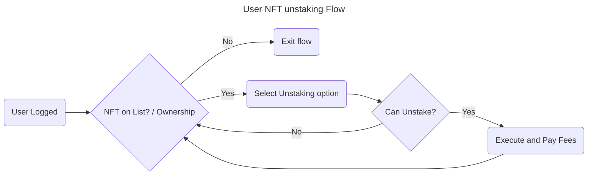

# 4. User NFT Unstaking Flow



## User Scenarios

### Feature: User NFT Unstaking

#### Scenario 1: Successful Unstaking

Title: User successfully unstakes NFT when eligible

```gherkin
Given the user is logged in
And the user's NFT is on the unstaking list
When the user selects the unstaking option for the NFT
And the system determines the NFT can be unstaked
And the user executes the unstaking and pays the fees
Then the unstaking is successfully applied to the NFT
And the user is redirected back to the NFT list for potential further actions.
```

#### Scenario 2: NFT Not on List - Exit Flow

Title: User exits flow when NFT is not on the unstaking list

```gherkin
Given the user is logged in
And the user's NFT is not on the unstaking list
When the user attempts to unstake the NFT
Then the user is notified that the NFT is not found
And the unstaking flow is exited
And the user is not prompted for unstaking options or fees
```

#### Scenario 3: Unstaking Not Possible (Cooldown/Restriction)

Title: User is unable to unstake due to restrictions

```gherkin
Given the user is logged in
And the user's NFT is on the unstaking list
When the user selects the unstaking option for the NFT
But the system determines the NFT cannot be unstaked due to restrictions
Then the user is notified of the reason for unable to unstake (e.g., cooldown period)
And the user is returned to the NFT list without executing unstaking
```

#### Scenario 4: Multiple Unstaking Attempts (Edge Case)

Title: User attempts to unstake the same NFT multiple times

```gherkin
Given the user is logged in
And the user's NFT is on the unstaking list
And the NFT can be unstaked
When the user selects the unstaking option, executes, and pays fees
And then attempts to unstake the same NFT again
Then the system's response is consistent with the NFT's updated status
And if the NFT is already unstaked, the user is notified accordingly
```

### Acceptance Criteria for User NFT Unstaking Flow

#### AC1: Successful Unstaking

* **ID:** AC-UNSTAKE-1
* **Description:** User can successfully unstake an eligible NFT.
* **Criteria:**

 1. **Precondition:** User is logged in, NFT is on the list and can be unstaked.
 2. **Step:** User selects unstaking option, executes, and pays fees.
 3. **Expected Result:**

     * Unstaking is applied successfully.
     * User is redirected back to the NFT list.

 4. **Acceptance Threshold:** 100% success rate for eligible NFTs.

#### AC2: Handling NFT Not on List

* **ID:** AC-UNSTAKE-2
* **Description:** System correctly handles NFTs not on the unstaking list.
* **Criteria:**

 1. **Precondition:** User is logged in, NFT is not on the list.
 2. **Step:** User attempts to unstake the NFT.
 3. **Expected Result:**

     * User is notified of NFT not found.
     * Flow is exited without prompting for unstaking options or fees.

 4. **Acceptance Threshold:** 100% of attempts with NFTs not on the list result in correct notification and flow exit.

#### AC3: Unstaking Restrictions

* **ID:** AC-UNSTAKE-3
* **Description:** System correctly handles NFTs with unstaking restrictions.
* **Criteria:**

 1. **Precondition:** User is logged in, NFT has unstaking restrictions.
 2. **Step:** User attempts to unstake the NFT.
 3. **Expected Result:**

     * User is notified of the specific restriction (e.g., cooldown).
     * Unstaking is not executed.

 4. **Acceptance Threshold:** 100% of restricted NFT attempts result in correct notification.

#### AC4: Multiple Unstaking Attempts**

* **ID:** AC-UNSTAKE-4
* **Description:** System correctly handles multiple unstaking attempts for the same NFT.
* **Criteria:**

 1. **Precondition:** User is logged in, NFT is on the list.
 2. **Step:** User makes multiple unstaking attempts for the same NFT.
 3. **Expected Result:**

     * System's response is consistent with the NFT's updated status after each attempt.

 4. **Acceptance Threshold:** 100% consistency in system response across multiple attempts.

#### Common Criteria

* **AC-UNSTAKE-5: Fee Payment Processing**
  * Fee payments are correctly deducted.
* **AC-UNSTAKE-6: User Notification**
  * Clear and concise notifications are provided for all outcomes (success, failure, restrictions).

#### Test Data Requirements

* Eligible NFTs for unstaking (at least 3)
* NFTs not on the unstaking list (at least 2)
* NFTs with various unstaking restrictions (cooldown, etc.) (at least 2)
* Multiple user accounts for concurrency testing (if applicable)

## Definition of Done (DoD)

* All acceptance criteria (AC-UNSTAKE-1 through AC-UNSTAKE-6) are met.
* Testing covers all happy and sad paths with specified test data.
