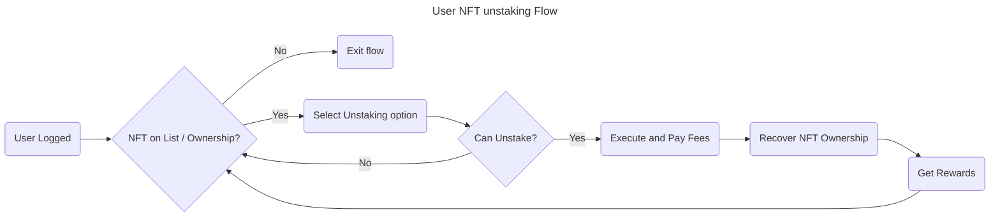

# 4. User NFT Unstaking Flow



## User Scenarios

### Feature: User NFT Unstaking

#### Scenario 1: Successful Unstaking with Rewards

Title: User successfully unstakes NFT, recovers ownership, and receives rewards

```gherkin
Given the user is logged in
And the user owns the NFT and it is on the unstaking list
When the user selects the unstaking option for the NFT
And the system determines the NFT can be unstaked
And the user executes the unstaking and pays the fees
Then the NFT ownership is successfully recovered by the user
And the user receives the applicable rewards
And the user is returned to the NFT list for potential further actions
```

#### Scenario 2: NFT Not on List or Not Owned - Exit Flow

Title: User exits flow when NFT is not on the list or not owned

```gherkin
Given the user is logged in
And the user's NFT is either not on the unstaking list or not owned by the user
When the user attempts to unstake the NFT
Then the user is notified of the issue (not found or not owned)
And the unstaking flow is exited
And the user is not prompted for unstaking options or fees
```

#### Scenario 3: Unstaking Not Possible (Restrictions)

Title: User is unable to unstake due to system restrictions

```gherkin
Given the user is logged in
And the user owns the NFT and it is on the unstaking list
When the user selects the unstaking option for the NFT
But the system determines the NFT cannot be unstaked due to restrictions
Then the user is notified of the specific restriction
And the user is returned to the NFT list without executing unstaking
```

#### Scenario 4: Multiple Actions After Unstaking (Edge Case)

Title: User performs multiple actions after successfully unstaking an NFT

```gherkin
Given the user is logged in
And the user owns the NFT and it is on the unstaking list
And the user has already unstaked the NFT, recovered ownership, and received rewards
When the user attempts to interact with the now unstaked NFT from the list
Then the system reflects the updated NFT status correctly
And the user can perform subsequent actions on the NFT as expected
```

#### Scenario 5: Error in Rewards Distribution

Title: System handles errors in rewards distribution after unstaking

```gherkin
Given the user is logged in
And the user owns the NFT and it is on the unstaking list
When the user selects the unstaking option for the NFT
And the system determines the NFT can be unstaked
And the user executes the unstaking and pays the fees
But an error occurs during rewards distribution
Then the unstaking is still applied successfully
And the NFT ownership is recovered by the user
And the user is notified of the rewards distribution error
And instructions for resolving the issue are provided
```

---

### Acceptance Criteria for User NFT Unstaking Flow

#### AC1: Successful Unstaking with Ownership Recovery and Rewards

* **ID:** AC-UNSTAKE-1
* **Description:** User successfully unstakes NFT, recovers ownership, and receives rewards.
* **Criteria:**

 1. **Precondition:** User is logged in, owns the NFT, and it's on the list.
 2. **Step:** User selects unstaking option, executes, and pays fees.
 3. **Expected Result:**
     * Unstaking successful.
     * Ownership recovered.
     * Rewards received.
 4. **Acceptance Threshold:** 100% success rate for eligible NFTs.

#### AC2: Handling NFT Not on List or Not Owned

* **ID:** AC-UNSTAKE-2
* **Description:** System correctly handles NFTs not on the list or not owned.
* **Criteria:**

 1. **Precondition:** User is logged in, NFT issue (not on list or not owned).
 2. **Step:** User attempts to unstake the NFT.
 3. **Expected Result:**
     * Correct notification.
     * Flow exited without prompting for options or fees.
 4. **Acceptance Threshold:** 100% correct handling for non-eligible NFTs.

#### AC3: Unstaking Restrictions

* **ID:** AC-UNSTAKE-3
* **Description:** System correctly handles NFTs with unstaking restrictions.
* **Criteria:**

 1. **Precondition:** User is logged in, NFT has restrictions.
 2. **Step:** User attempts to unstake the NFT.
 3. **Expected Result:**
     * Correct restriction notification.
     * Unstaking not executed.
 4. **Acceptance Threshold:** 100% correct restriction handling.

#### AC4: Post-Unstaking Actions

* **ID:** AC-UNSTAKE-4
* **Description:** System correctly handles user actions after unstaking.
* **Criteria:**

 1. **Precondition:** User has successfully unstaked an NFT.
 2. **Step:** User interacts with the unstaked NFT.
 3. **Expected Result:**
     * Updated NFT status reflected.
     * Subsequent actions possible as expected.
 4. **Acceptance Threshold:** 100% seamless post-unstaking experience.

#### AC5: Error Handling in Rewards Distribution

* **ID:** AC-UNSTAKE-5
* **Description:** System correctly handles errors in rewards distribution.
* **Criteria:**

 1. **Precondition:** Error occurs during rewards distribution after unstaking.
 2. **Step:** System response to error.
 3. **Expected Result:**
     * Unstaking still successful.
     * Ownership recovered.
     * Error notification with resolution instructions.
 4. **Acceptance Threshold:** 100% correct error handling and user notification.

#### Common Criteria

* **AC-UNSTAKE-6: Fee Payment Processing**
  * Fee payments are processed securely (e.g., HTTPS) and correctly deducted.
* **AC-UNSTAKE-7: User Notification**
  * Clear and concise notifications are provided for all outcomes (success, failure, restrictions).

### Test Data Requirements

* NFTs on the unstaking list owned by the user (at least 3)
* NFTs not on the unstaking list or not owned by the user (at least 2)
* NFTs with various unstaking restrictions (at least 2)
* Scenarios for testing rewards distribution errors
* Multiple user accounts for concurrency testing (if applicable)

## Definition of Done (DoD)

* All acceptance criteria (AC-UNSTAKE-1 through AC-UNSTAKE-7) are met.
* Testing covers all happy and sad paths with specified test data.
* Security audits confirm secure payment processing.
* Stakeholder approval is obtained after a successful demo of the NFT unstaking feature.
