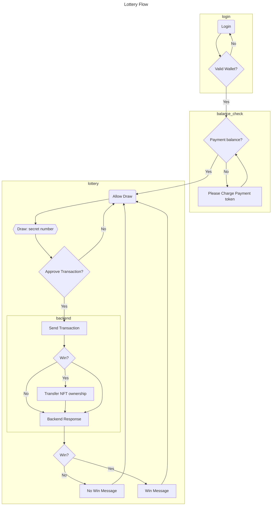

# 5. Lottery

## Flow

Prerequisites:

- NFT ownership transferred to the smart contract `Lottery`



## Features

### Successful Lottery Participation

```gherkin
Feature: Successful Lottery Participation
  Scenario: User participates in the lottery and wins
    Given a user with a valid wallet and sufficient balance
    When the user logs in and initiates the lottery draw
    And the user approves the transaction
    Then the backend processes the transaction and determines a winner
    And the user is notified of the win
```

```gherkin
Acceptance Criteria:
  Given a user with a valid wallet and sufficient balance
  When the user logs in and initiates the lottery draw
  Then The system should:
    - verify the user's wallet address and balance.
    - generate a random lottery number for the user.
    - prompt the user to approve the transaction.
    - After user approval, the system should process the transaction on the blockchain.
    - determine the winning lottery numbers.
    - compare the user's lottery number with the winning numbers.
    - If the user's number matches a winning number, the system should:
      - Transfer the corresponding prize (NFT or token) to the user's wallet.
      - Send a notification to the user informing them of their win and the prize details.
    - If the user's number does not match a winning number, the system should:
      - Send a notification to the user informing them of the loss.
```

### Insufficient Balance

```gherkin
Feature: Insufficient Balance
  Scenario: User attempts to participate with insufficient balance
    Given a user with a valid wallet but insufficient balance
    When the user logs in and initiates the lottery draw
    Then the system prompts the user to charge their payment token
    And the user can retry the lottery draw after charging
```

### Cancelled Transaction

```gherkin
Feature: Cancelled Transaction

  Scenario: User fails to approve the transaction
    Given a user with a valid wallet and sufficient balance
    When the user logs in and initiates the lottery draw
    And the user rejects the transaction
    Then the lottery draw is canceled
    And the user can retry the lottery draw
```
